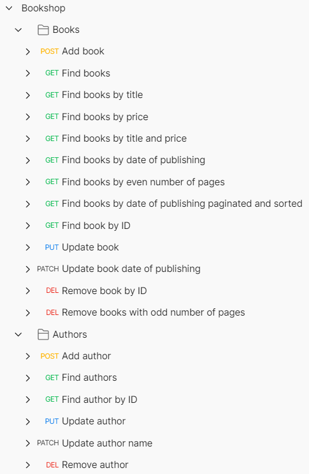

# Bookshop
- a RESTful API for managing books and authors
- uses Spring Data Repositories 
- exemplifies concepts such as derived queries and specifications as well
## Presentation
[Presentation](https://docs.google.com/presentation/d/e/2PACX-1vRBeFoEOUACjjGHLjRexW5_5hfwV65mJn_I1AkQQKBR9MuLuFNstIfzgI1F8obkqPTeQEUv6b36LFP4/pub?start=false&loop=false&delayms=10000)
## Postman collection

